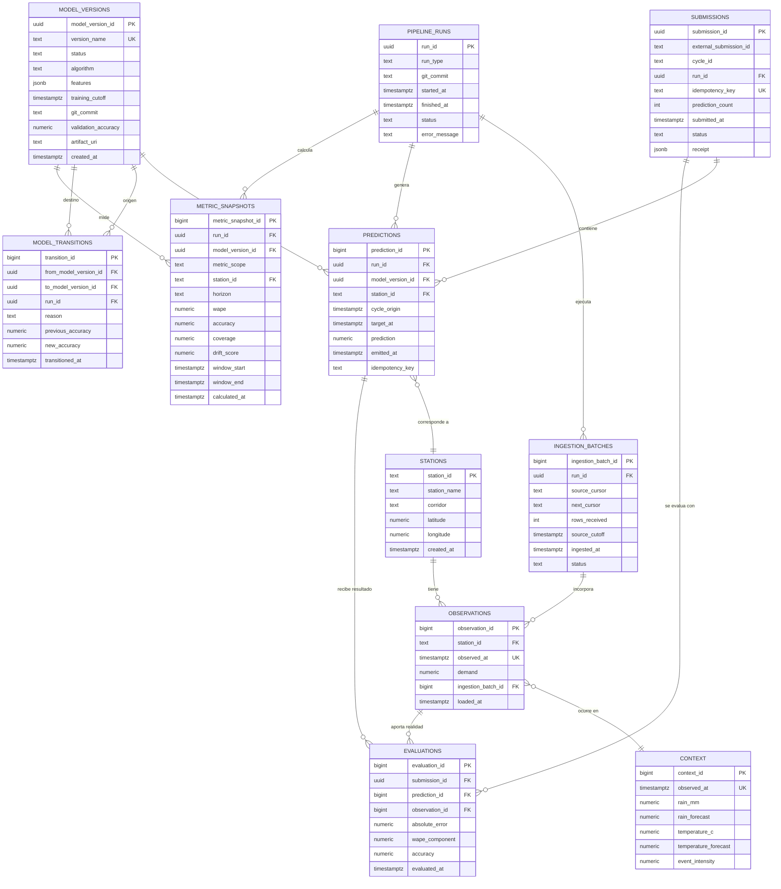

# Modelo entidad-relación — Pulso TransMi

Este modelo representa la memoria operacional recomendada para Supabase/PostgreSQL. Separa los datos observados, la operación del pipeline, los modelos y la evaluación de predicciones.

## Diagrama



## Relaciones principales

| Relación | Cardinalidad | Propósito |
|---|---:|---|
| `stations` → `observations` | 1:N | Una estación tiene muchas observaciones temporales. |
| `observations` ↔ `context` | N:1 por `observed_at` | La demanda se relaciona con el contexto disponible en el mismo instante. |
| `pipeline_runs` → `ingestion_batches` | 1:N | Una ejecución puede procesar uno o varios lotes paginados. |
| `model_versions` → `predictions` | 1:N | Cada predicción debe identificar el modelo que la produjo. |
| `submissions` → `predictions` | 1:N | Una submission agrupa las predicciones de un ciclo. |
| `predictions` → `evaluations` | 1:0..1 o 1:N | Una predicción puede evaluarse cuando aparece la realidad; la evaluación puede ser progresiva. |
| `model_versions` → `model_transitions` | 1:N | Permite reconstruir cuándo y por qué un modelo pasó a ser champion o fue reemplazado. |
| `metric_snapshots` → modelo/estación/horizonte | N:1 | Conserva accuracy, cobertura y drift a lo largo del tiempo. |

## Restricciones recomendadas

```sql
-- No duplicar una observación de una estación en el mismo instante.
UNIQUE (station_id, observed_at)

-- No duplicar el mismo intento lógico de submission.
UNIQUE (idempotency_key)

-- Una predicción debe ser única por modelo, estación, ciclo y objetivo.
UNIQUE (model_version_id, station_id, cycle_origin, target_at)

-- La demanda no puede ser negativa.
CHECK (demand >= 0)

-- Una predicción enviada debe ser finita y no negativa.
CHECK (prediction >= 0)
```

## Notas de implementación

- `station_id` debe almacenarse como `text`, porque la documentación de la API exige conservar ceros iniciales.
- `source_cursor` y `next_cursor` deben guardarse sin modificarlos. El cursor solo se confirma después de completar el `upsert` del lote.
- `model_versions` debe guardar el `artifact_uri` de Supabase Storage; nunca se debe cargar simplemente “el archivo más reciente”.
- `pipeline_runs` registra también las ejecuciones sin novedades y las fallidas.
- La API key y las credenciales de Supabase no pertenecen a ninguna tabla: deben permanecer en GitHub Actions Secrets.
- El modelo permite consultar tanto el desempeño acumulado como el rolling de 24 horas mediante `metric_snapshots`.

## Prioridad de construcción

### Mínimo inicial

`stations`, `observations`, `context`, `pipeline_runs`, `ingestion_batches`, `model_versions` y `predictions`.

### Operación competitiva

Agregar `submissions`, `evaluations` y `metric_snapshots`.

### Trazabilidad avanzada

Agregar `model_transitions`, rollback y auditoría detallada de decisiones.
